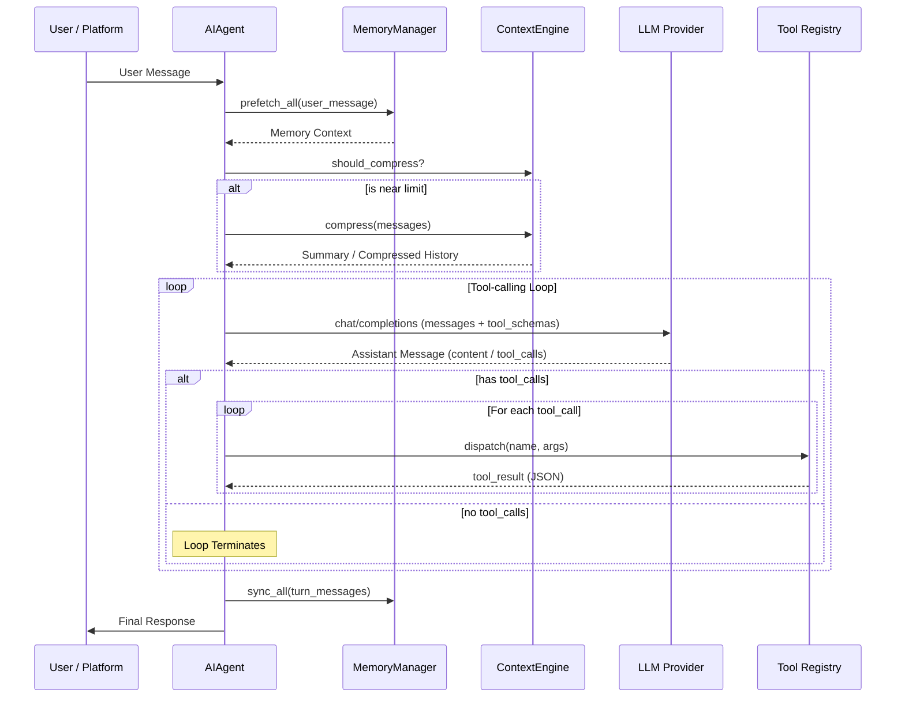

# Agent Conversation Loop

```mermaid
sequenceDiagram
    participant U as User / Platform
    participant A as AIAgent
    participant M as MemoryManager
    participant C as ContextEngine
    participant L as LLM Provider
    participant T as Tool Registry

    U->>A: User Message
    A->>M: prefetch_all(user_message)
    M-->>A: Memory Context
    A->>C: should_compress?
    alt is near limit
        A->>C: compress(messages)
        C-->>A: Summary / Compressed History
    end

    loop Tool-calling Loop
        A->>L: chat/completions (messages + tool_schemas)
        L-->>A: Assistant Message (content / tool_calls)

        alt has tool_calls
            loop For each tool_call
                A->>T: dispatch(name, args)
                T-->>A: tool_result (JSON)
            end
        else no tool_calls
            Note over A: Loop Terminates
        end
    end

    A->>M: sync_all(turn_messages)
    A->>U: Final Response
```
