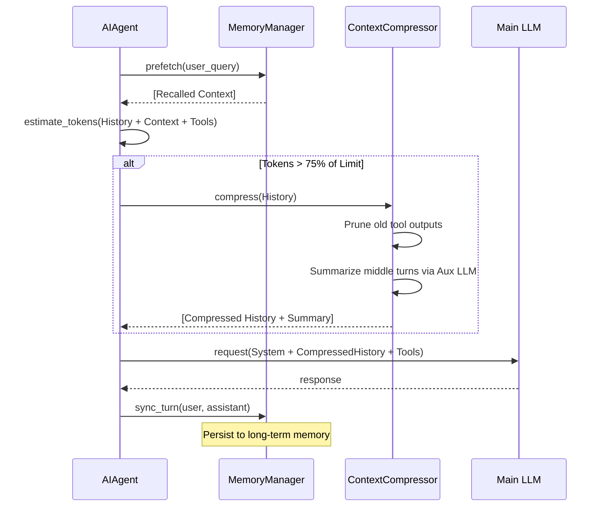

# Hermes Agent: Context Memory & Token Management

## 1. Context Maintenance Overview

Hermes Agent uses a hybrid approach to maintain long-term and short-term context while staying within the model's token limits.

### 1.1. Context Maintenance Lifecycle
```text
[ Conversation Start ]
       |
       v
+--------------------------+
| System Prompt Assembly   | <--- Static Instructions + Profile + Static Memory
+--------------------------+
       |
       v
+--------------------------+      +---------------------------+
| Memory Prefetch          | <--- | External Memory Providers | (Honcho, Mem0, etc.)
| (Top-k Retrieval)        |      +---------------------------+
+--------------------------+
       |
       v
+--------------------------+
| Preflight Token Check    |
+--------------------------+
       |
       | If tokens > threshold:
       v
+--------------------------+      +---------------------------+
| Context Compression      | <--- | Auxiliary LLM (Summarizer)|
| (Summarize middle turns) |      +---------------------------+
+--------------------------+
       |
       v
+--------------------------+
| Request Construction     | <--- System + Messages + Tool Schemas
+--------------------------+
       |
       v
[ API Call to LLM ]
```

## 2. Token Overconsumption & "Surplus" Analysis

Every request to an LLM includes overhead beyond the actual user/assistant messages. In Hermes, this "surplus" can be significant.

### 2.1. Sources of Token Surplus
| Bucket | Approximate Size | Why it exists |
| :--- | :--- | :--- |
| **Tool Schemas** | 10,000 - 30,000+ tokens | Every enabled tool's JSON definition must be sent so the model knows how to call it. |
| **System Prompt** | 2,000 - 5,000 tokens | Core instructions, persona (SOUL.md), and static capability notes. |
| **Memory Injections** | 1,000 - 4,000 tokens | Relevant snippets retrieved from past sessions (recalled memory). |
| **Summarization** | 2,000 - 12,000 tokens | The summary block created by the ContextCompressor to preserve history. |
| **Reasoning (CoT)** | Model dependent | Thinking blocks from reasoning models (e.g., `<think>`) consume output tokens. |

### 2.2. The Cost of "Keeping Memory"
When the system attempts to maintain continuity, it "wastes" tokens in two ways:
1.  **Redundancy**: Injected memories might overlap with information already in the history.
2.  **Compression Loss**: Using an auxiliary model to summarize costs tokens for the summarization call itself, plus the tokens occupied by the resulting summary in the main prompt.

## 3. Context Maintenance Flow (Sequence)



### ASCII Representation
```text
       AIAgent                MemoryManager           ContextCompressor           LLM
          |                         |                         |                    |
          |---- 1. Prefetch ------->|                         |                    |
          |<--- [Context snippets] -|                         |                    |
          |                         |                         |                    |
          |---- 2. Check Tokens ----------------------------->|                    |
          |                         |                         |                    |
          |       [ If tokens near limit: ]                   |                    |
          |---- 3. Compress(History) ------------------------>|                    |
          |                         | <--- 4. Summarize ----> |                    |
          |<--- [New History + Summary] ----------------------|                    |
          |                         |                         |                    |
          |---- 5. Full Prompt (System + History + Tools) ------------------------>|
          |                         |                         |                    |
          |<--- 6. LLM Response ---------------------------------------------------|
          |                         |                         |                    |
          |---- 7. Sync turn ------>|                         |                    |
          |                         |---- 8. Store in DB ---->|                    |
```

## 4. What Warrants Token Overconsumption?

Token consumption can spike unexpectedly due to:
1.  **Large Toolsets**: Enabling toolsets like `browser`, `terminal`, and `file` simultaneously adds tens of thousands of tokens of JSON schemas.
2.  **Multimodal Content**: Each image attached to a message is estimated at **1,500-1,600 tokens**, regardless of the actual file size.
3.  **High-Latency Tools**: If a tool returns a massive output (e.g., a long file read or a detailed web extract), it can consume the remaining context window in a single turn, triggering aggressive compression.
4.  **Prefix Cache Misses**: If the system prompt or history is modified mid-conversation (e.g., installing a new skill with `/skills install --now`), the model's prompt cache is invalidated, causing a full re-computation of input tokens.
