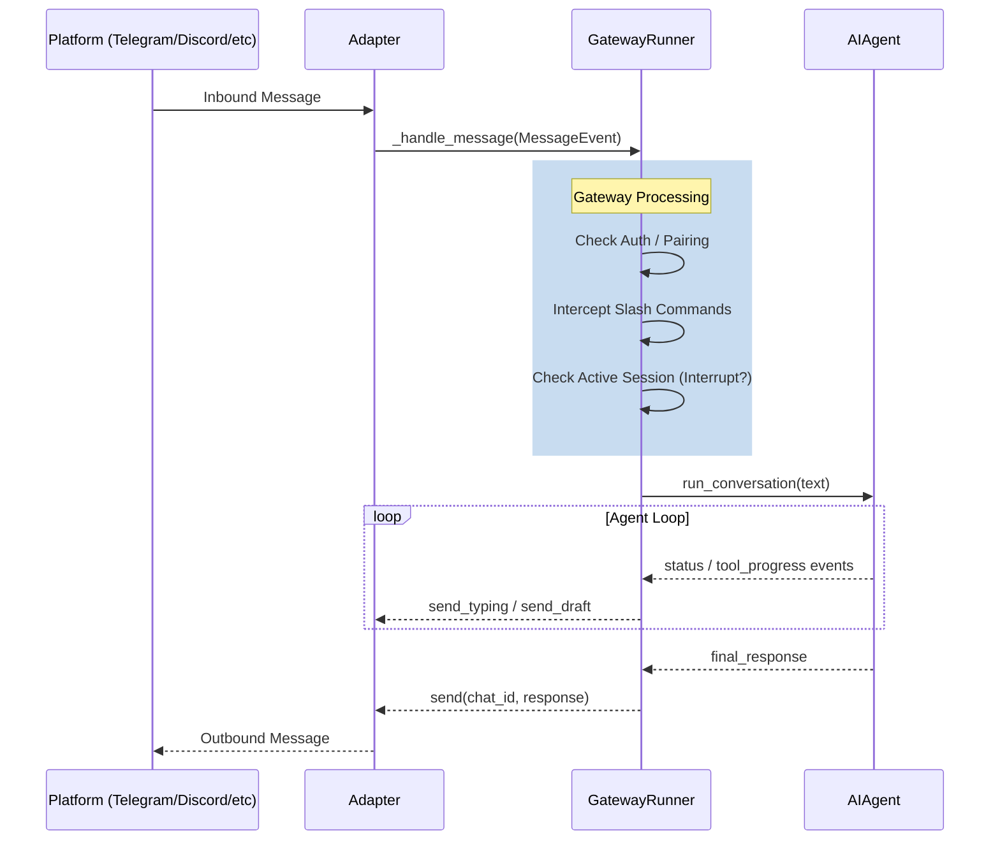

# Gateway Message Flow

## Mermaid.js Diagram


## ASCII Diagram
```text
  PLATFORM              ADAPTER             GATEWAY RUNNER             AI AGENT
      |                    |                      |                        |
      |--- Inbound Msg --->|                      |                        |
      |                    |--- _handle_message ->|                        |
      |                    |                      |                        |
      |                    |             +------------------+              |
      |                    |             | 1. Auth/Pairing  |              |
      |                    |             | 2. Slash Cmds    |              |
      |                    |             | 3. Interrupts    |              |
      |                    |             +------------------+              |
      |                    |                      |                        |
      |                    |                      |--- run_conversation -->|
      |                    |                      |                        |
      |                    |             [ Agent Execution Loop ]          |
      |                    |                      |<-- status/progress ----|
      |                    |<--- send_typing -----|                        |
      |                    |                      |                        |
      |                    |                      |<--- final_response ----|
      |                    |<--- send(resp) ------|                        |
      |<--- Outbound Msg --|                      |                        |
      |                    |                      |                        |
```
