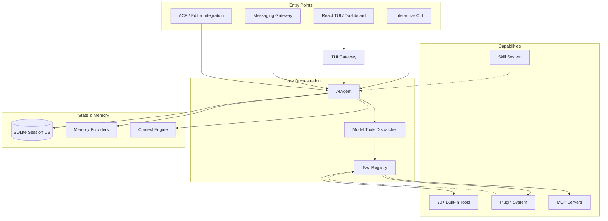

# High-Level System Architecture

```mermaid
graph TD
    subgraph "Entry Points"
        CLI[Interactive CLI]
        TUI[React TUI / Dashboard]
        GW[Messaging Gateway]
        ACP[ACP / Editor Integration]
    end

    subgraph "Core Orchestration"
        Agent[AIAgent]
        ModelTools[Model Tools Dispatcher]
        Registry[Tool Registry]
    end

    subgraph "Capabilities"
        Tools[70+ Built-in Tools]
        Plugins[Plugin System]
        Skills[Skill System]
        MCP[MCP Servers]
    end

    subgraph "State & Memory"
        DB[(SQLite Session DB)]
        Memory[Memory Providers]
        Context[Context Engine]
    end

    CLI --> Agent
    TUI --> TUI_GW[TUI Gateway]
    TUI_GW --> Agent
    GW --> Agent
    ACP --> Agent

    Agent --> ModelTools
    ModelTools --> Registry
    Registry --> Tools
    Registry --> MCP
    Registry --> Plugins

    Agent --> DB
    Agent --> Memory
    Agent --> Context

    Plugins -.-> Registry
    Skills -.-> Agent
```
