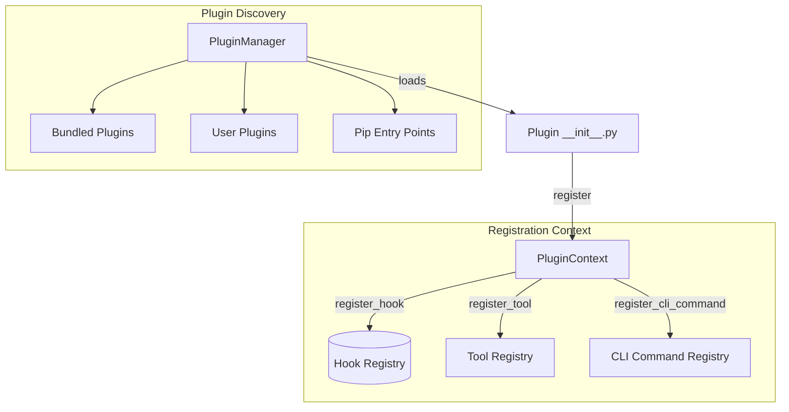

# Plugin Registry System

```mermaid
graph TD
    subgraph "Plugin Discovery"
        PM[PluginManager]
        Bundle[Bundled Plugins]
        User[User Plugins]
        Pip[Pip Entry Points]
    end

    subgraph "Registration Context"
        Ctx[PluginContext]
        Hooks[(Hook Registry)]
        Registry[Tool Registry]
        Cmds[CLI Command Registry]
    end

    PM --> Bundle
    PM --> User
    PM --> Pip

    PM -->|loads| P[Plugin __init__.py]
    P -->|register| Ctx

    Ctx -->|register_hook| Hooks
    Ctx -->|register_tool| Registry
    Ctx -->|register_cli_command| Cmds
```
